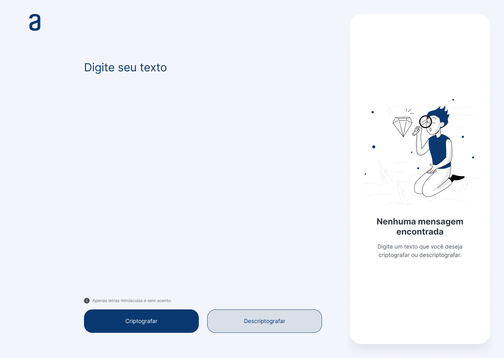
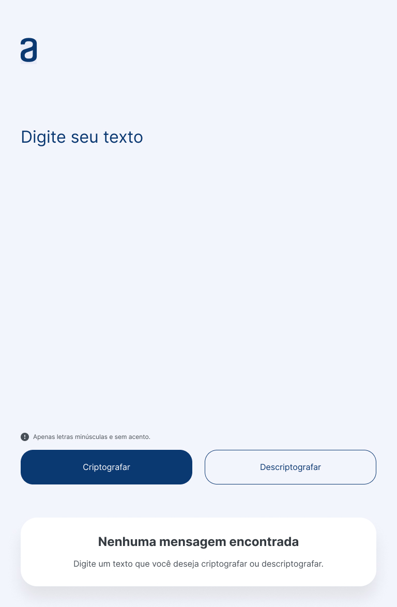
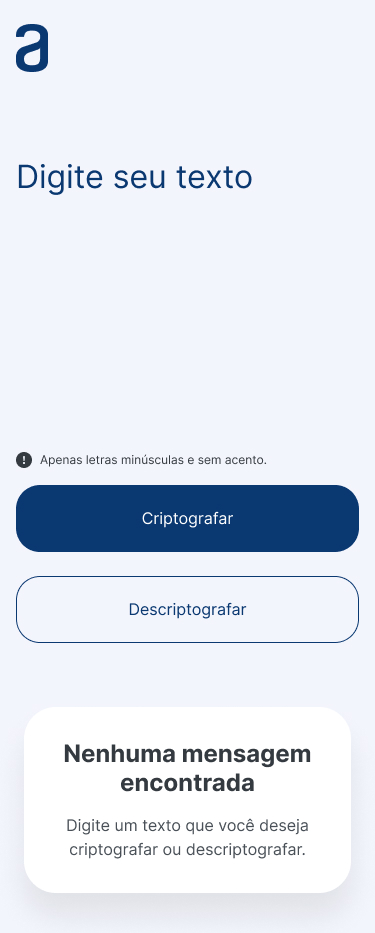
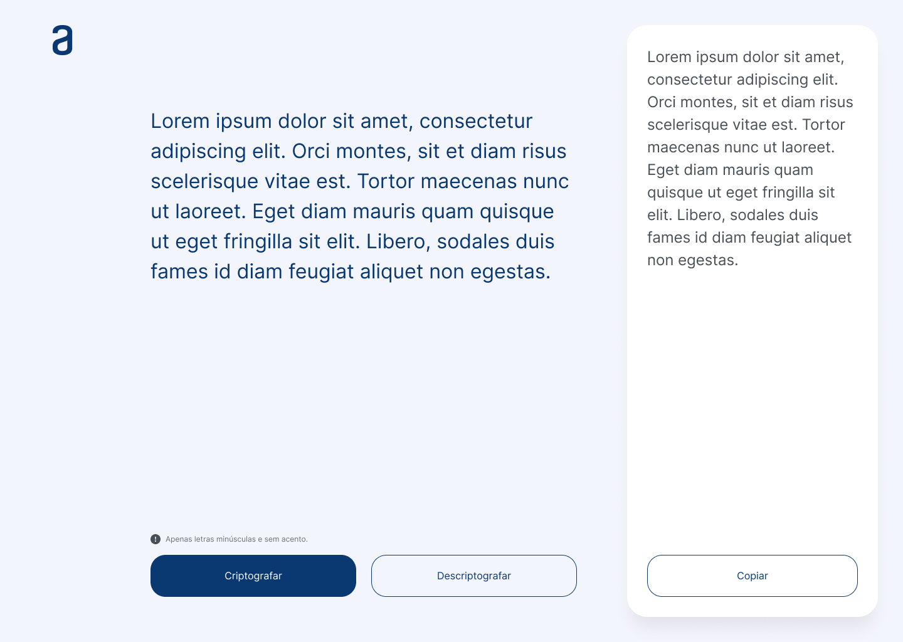
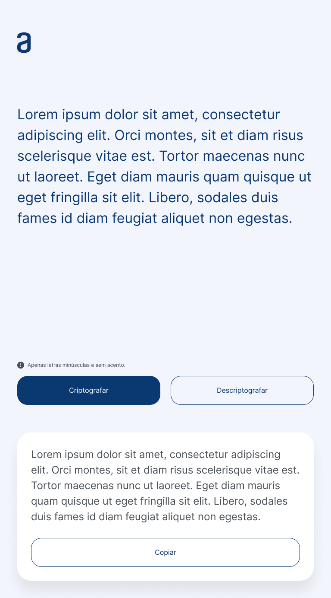
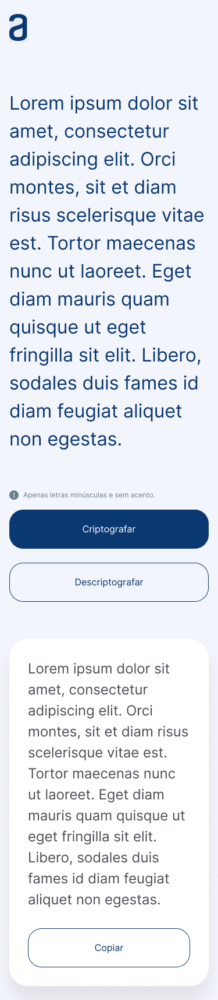

## 1 Challenge Iniciante em Programação

Nesse projeto o objetivo é desenvolver as habilidades em lógica de programação com javascript e de estilização com html e css.

O desafio é para desenvolver um **Decodificador de Texto** e a seguir temos as especificações dessa aplicação.

No [Figma](https://www.figma.com/file/oyLhf95YznIWjFKmN7Awcx/Alura-Challenge---Desafio-1---Decodificador-de-Texto?node-id=49%3A477&mode=dev), temos o design a seguir seguindo com os detalhes no projeto 
**Alura Challenge - Desafio 1 - Decodificador de Texto**.

- Tela 1 Desktop

   

 
- Tela 1 Tablet e Mobile

  
   
   

 

- Tela 2 Desktop

    

 
- Tela 2 Tablet e Mobile

  
   
   

 

### Gestão do projeto

- branch main com o projeto em produção
- branch challenge-1 com a versão do desafio
- uma branch para cada grupo de tarefas que gera valor

### Desenvolvimento do projeto

- [x] criar branch challenge-1
- [x] criar branch feature/html-css
- [x] Configurar vscode com Live Server
- [x] Estrutura html
- [x] favicon
- [x] Google Fonts: [Inter](https://fonts.google.com/specimen/Inter?query=inter)
- [x] Icon e Imagem
- [x] criar branch feature/js-logica

### Referências

Para te apoiar nesta tarefa, nós separamos para vocês alguns materiais de apoio:

Vídeos de resolução das principais partes do Challenge e repositório com o código.

- [Parte I - HTML e CSS](https://www.youtube.com/watch?v=04QvWw4aHlk), onde apresentamos a construção da estrutura com o HTML e uma parte da estilização com CSS. 

Tarefa desenvolvida na branch feature/html-css, mergeada na branch challenge-1 para validação, testes e aprovação para então mergeada na branch de produção main.

- [Parte II- Lógica com JavaScript](https://www.youtube.com/watch?v=e3PasHJMIF8), nele apresentamos o desenvolvimento das funções principais: codificar e decodificar o texto.

Tarefa desenvolvida na branch feature/js-logica, mergeada na branch challenge-1 para validação, testes e aprovação para então mergeada na branch de produção main.

As "chaves" de criptografia que utilizaremos são:
`A letra "e" é convertida para "enter"`
`A letra "i" é convertida para "imes"`
`A letra "a" é convertida para "ai"`
`A letra "o" é convertida para "ober"`
`A letra "u" é convertida para "ufat"`

- O [Challenge Decodificador](https://github.com/logica-programacion/Solucao-Challenge-Decodificador) e o [challenge one decodificador br](https://github.com/alura-challenges/challenge-one-decodificador-br) para que você possa fazer consultas e se inspirar para a construção do seu próprio código.

Bons estudos!

### Aperfeiçoamentos

- CSS
- [ ] utilizar variáveis para melhorar o código
- [ ] responsividade

- HTML
- [ ] revisar as tags semânticas
- [ ] nomes em inglês

- JS
- [ ] implementar a função para o botão copiar
- [ ] adicionar 1 funcionalidade
- [ ] criptografar o alfabeto inteiro
- [ ] criptografar os números

### Challenge ONE 1

E após de terminar o desenvolvimento do projeto desafio, ir até o formulário e preencher com as informações para garantir o cumprimento da tarefa.

[Instruções do Challenge ONE 1](https://www.alura.com.br/challenges/challenge-one-logica)
  - [Detalhes sobre esse challenge](https://www.alura.com.br/challenges/challenge-one-logica/sprint01-construa-decodificador-texto-com-javascript)
  - [Explicação sobre o challenge](https://www.youtube.com/watch?v=VwVC_bLcOGE)
  - [Trello do projeto](https://trello.com/b/EmUFmjCv/decodificador-de-texto-alura-challenges-oracle-one)
  - [Figma do projeto](https://www.figma.com/file/tvFEYhVfZTjdJ5P24RGV21/Alura-Challenge---Desafio-1---L%C3%B3gica?node-id=16%3A802&mode=dev)
  - [Como dev usa Figma?](https://cursos.alura.com.br/extra/alura-mais/como-front-end-utiliza-o-figma-c858)
  - [Como colocar seu projeto no ar com o Github Pages?](https://www.alura.com.br/artigos/como-colocar-projeto-no-ar-com-github-pages)
  - [Começando com Git: Aprendendo a versionar](https://www.alura.com.br/artigos/comecando-com-git-aprendendo-versionar)
  - [Como colocar seu projeto no ar com o Github Pages?](https://www.alura.com.br/artigos/como-colocar-projeto-no-ar-com-github-pages)
  - [Entregar o decodificador de texto](https://lp.alura.com.br/alura-latam-entrega-challenge-one-portugues)

### Meu resultado

Realizado a publicação do projeto na url a seguir para testar usando o projeto [Text Decoder](https://douglasabnovato.github.io/text-decoder/).
